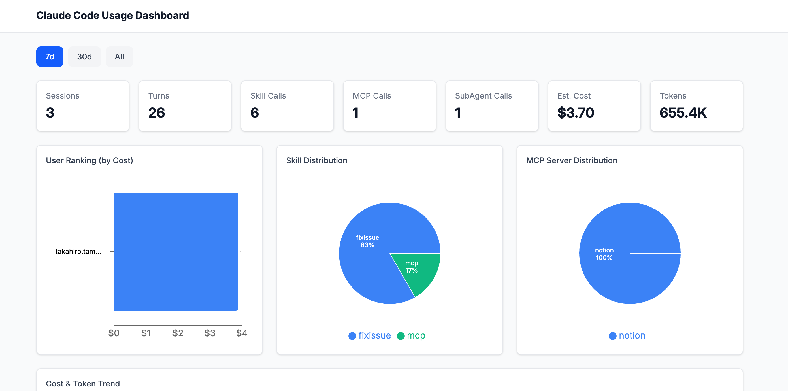

# Claude Code Usage Dashboard

A self-hosted dashboard to visualize and share [Claude Code](https://docs.anthropic.com/en/docs/claude-code) usage across your team.

A Stop hook automatically parses transcripts at session end, collecting token consumption, skill / MCP / sub-agent usage, and estimated costs into interactive charts.



## Features

- **Data Collection** — Zero-config data collection via Stop hook
- **Token & Cost Tracking** — Input / output / cache read / cache creation tokens with per-model cost estimation
- **Skill Analysis** — Invocation frequency of `/commit`, `/fixissue`, and other skills
- **MCP Server Analysis** — Call counts by MCP server name and method
- **Sub-agent Analysis** — Agent tool usage (Explore, Plan, etc.)
- **Team Overview** — Per-user cost ranking, daily trends, model distribution


## Setup

### 1. Install the plugin

Installing the plugin on a project enables automatic data submission to the dashboard when a Claude Code session ends.

```bash
# Register the marketplace (only registered locally, not published externally)
claude plugin marketplace add https://github.com/sec-dev-lab/ClaudeCodeDashboard.git

# Install the plugin (applies to the target project only)
claude plugin install claude-code-usage-dashboard-plugin@sec-dev-lab --scope project
```

### 2. Set environment variables

Add the dashboard URL to `.env` in the target project root.

```bash
# For local development (cd dashboard && npm run dev)
CLAUDE_CODE_USAGE_DASHBOARD_URL=http://localhost:5173

# For a deployed dashboard
CLAUDE_CODE_USAGE_DASHBOARD_URL=https://dashboard.your-account.workers.dev
```

### Local testing

To test with a local clone of this repository instead of the remote:

```bash
# Register from local path (run from the repository root)
claude plugin marketplace add ./

# Install the plugin
claude plugin install claude-code-usage-dashboard-plugin@sec-dev-lab --scope project
```

### Uninstall

```bash
# Disable for your local environment
claude plugin disable claude-code-usage-dashboard-plugin --scope local

# Remove from the project
claude plugin uninstall claude-code-usage-dashboard-plugin --scope project
```


## Architecture

```
Claude Code session ends
  │
  ▼
Stop hook (session-uploader.py)
  │  Parses ~/.claude/projects/{hash}/{session_id}.jsonl
  │  Extracts tokens, skills, MCP calls, sub-agent events
  │
  ▼
POST /api/v1/usage/ingest
  │
  ▼
Web application (React Router v7 SSR)
  │
  ▼
Database (SQLite)
  │
  ▼
Dashboard UI (Recharts)
```

## Data Collection Hook

The Stop hook (`hooks/session-uploader.py`) runs automatically when a Claude Code session ends.

### Collected Data

| Data | Description |
|------|-------------|
| Session info | session_id, project, branch, model, timestamps, conversation turns |
| Tokens | input, output, cache_read, cache_creation |
| Skill events | `/commit`, `/fixissue`, etc. (extracted from `<command-message>` tags) |
| MCP events | Server name, method name (e.g. `notion/notion-fetch`) |
| Sub-agent events | Agent type (Explore, Plan, etc.) |

> Estimated costs are not stored in the DB. They are calculated dynamically at display time using token counts, models, and a pricing table.


## Project Structure

```
ClaudeCodeDashboard/
├── .claude-plugin/
│   └── marketplace.json             # Marketplace definition
├── plugin/                          # Plugin package
│   ├── .claude-plugin/
│   │   └── plugin.json              # Plugin metadata
│   └── hooks/
│       ├── hooks.json               # Hook definition
│       └── session-uploader.py      # Stop hook (transcript parsing + API submission)
├── dashboard/
│   ├── app/
│   │   ├── routes/              # Dashboard pages + Ingest API
│   │   ├── components/          # Chart & UI components
│   │   └── lib/                 # Types, DB queries, cost calculation
│   ├── migrations/              # D1 schema
│   └── workers/                 # Workers entry point
└── README.md
```
