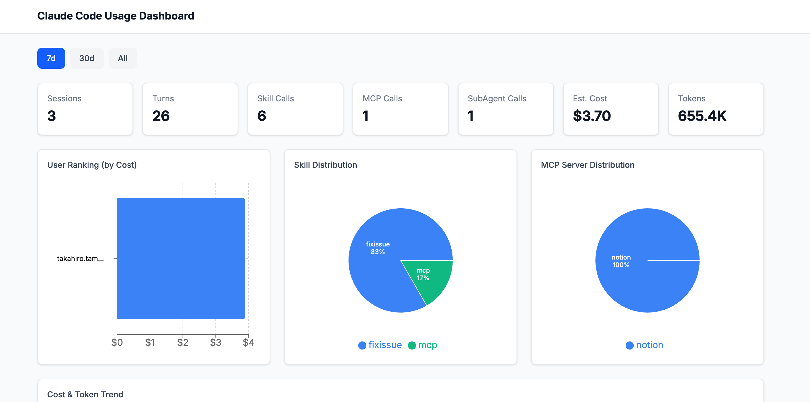

# Claude Code Usage Dashboard

A self-hosted dashboard to visualize and share [Claude Code](https://docs.anthropic.com/en/docs/claude-code) usage across your team.

A hook automatically parses transcripts during the session (after an assistant turn, at most every 5 minutes by default) and at session end, collecting token consumption, skill / MCP / sub-agent usage, and estimated costs into interactive charts.



## Features

- **Data Collection** — Zero-config data collection via Stop / SessionEnd hooks; the dashboard is refreshed while a session is still running, not only after it ends
- **Token & Cost Tracking** — Input / output / cache read / cache creation tokens with per-model cost estimation
- **Skill Analysis** — Invocation frequency of `/commit` and other slash commands
- **MCP Server Analysis** — Call counts by MCP server name and method
- **Sub-agent Analysis** — Agent tool usage (Explore, Plan, etc.)
- **Team Overview** — Per-user cost ranking, daily trends, model distribution


## Setup

### 1. Install the plugin

Installing the plugin enables automatic data submission to the dashboard while a Claude Code session is running and when it ends.

```bash
# Register the marketplace (only registered locally, not published externally)
claude plugin marketplace add https://github.com/hi-hori/ClaudeCodeUsageDashboard.git

# Install the plugin (applies to all projects)
claude plugin install claude-code-usage-dashboard-plugin@hi-hori
```

### 2. Set environment variables

Create `~/.claude-code-usage-dashboard/env` with your dashboard URL. This config is shared across all projects.

```bash
mkdir -p ~/.claude-code-usage-dashboard
cp .env.example ~/.claude-code-usage-dashboard/env
```

Then edit `~/.claude-code-usage-dashboard/env`:

```bash
# For local development (cd dashboard && npm run dev)
CLAUDE_CODE_USAGE_DASHBOARD_URL=http://localhost:5173

# For a deployed dashboard
CLAUDE_CODE_USAGE_DASHBOARD_URL=https://dashboard.your-account.workers.dev

# Optional: restrict to specific directories (fnmatch patterns, comma-separated)
# If unset, all projects are allowed.
CLAUDE_CODE_USAGE_DASHBOARD_ALLOWED_DIRS=/Users/me/work/*,/Users/me/oss/*

# Optional: minimum seconds between mid-session uploads (default: 300).
# 0 uploads after every assistant turn. Session end always uploads.
CLAUDE_CODE_USAGE_DASHBOARD_UPLOAD_INTERVAL=300
```

### Verify setup

You can verify the setup completed successfully:

- **Plugin**: `claude plugin list` includes `claude-code-usage-dashboard-plugin`
- **Environment**: `~/.claude-code-usage-dashboard/env` exists and `CLAUDE_CODE_USAGE_DASHBOARD_URL` is set
- **Auth**: `claude auth status` shows your email (used for user identification)

**In-session check**: Run `/claude-code-usage-dashboard:status` in any Claude Code session to see whether the dashboard is enabled for the current process. This reports plugin status, config, auth, and whether the project directory is allowed.

### Update

`claude plugin install` is a no-op if the plugin is already installed. To pick up a new version, refresh the marketplace and run `update` (restart Claude Code afterwards).

```bash
claude plugin marketplace update hi-hori
claude plugin update claude-code-usage-dashboard-plugin@hi-hori
```

### Uninstall

```bash
claude plugin uninstall claude-code-usage-dashboard-plugin
```

## Running the dashboard locally

Prerequisites: Node.js 18+, Wrangler CLI (`npm install -g wrangler`)

```bash
cd dashboard
npm install

# Apply migrations to local D1
npx wrangler d1 migrations apply claude-code-usage-dashboard-v2 --local

# Start the dev server
npm run dev
```

The application will be available at `http://localhost:5173`.

### Local testing

To test with a local clone of this repository instead of the remote:

```bash
# Register from local path (run from the repository root)
claude plugin marketplace add ./

# Install the plugin
claude plugin install claude-code-usage-dashboard-plugin@hi-hori
```

## Architecture

```
Assistant turn ends (Stop, async, throttled)  /  Claude Code session ends (SessionEnd)
  │
  ▼
Hook (session-uploader.py)
  │  Parses ~/.claude/projects/{hash}/{session_id}.jsonl
  │  Extracts tokens, skills, MCP calls, sub-agent events
  │  Sends the cumulative snapshot of the session so far
  │
  ▼
POST /api/v1/usage/ingest
  │  Credits only the increment since the session's previous upload
  │
  ▼
Web application (React Router v7 SSR)
  │
  ▼
Database (SQLite)
  │
  ▼
Dashboard UI (Recharts)
```

## Data Collection Hook

The hook script (`hooks/session-uploader.py`) is registered for two events:

| Event | When | Behaviour |
|-------|------|-----------|
| `Stop` | After every assistant turn (runs in the background, never blocks the session) | Uploads if at least `CLAUDE_CODE_USAGE_DASHBOARD_UPLOAD_INTERVAL` seconds (default 300) have passed since the session's previous upload; otherwise exits immediately |
| `SessionEnd` | When the session ends | Always uploads the final snapshot |

Every upload contains the cumulative totals of the whole session, and the ingest API credits only the increment over what it has already stored for that session, so uploading repeatedly never double-counts. Throttle markers and a per-session lock (so a background `Stop` upload and the `SessionEnd` upload never run at the same time) live in `~/.claude-code-usage-dashboard/state/`.

### Collected Data

| Data | Description |
|------|-------------|
| Session info | session_id, project, branch, model, timestamps, conversation turns |
| Tokens | input, output, cache_read, cache_creation |
| Skill events | `/commit` etc. (extracted from `<command-message>` tags) |
| MCP events | Server name, method name (e.g. `notion/notion-fetch`) |
| Sub-agent events | Agent type (Explore, Plan, etc.) |

> **Cost.** The hook sends the cost Claude Code itself reports for the session (the transcript's `cost-state` record, which is priced per model). Claude Code writes that record only when a session ends, so mid-session uploads carry no reported cost and the dashboard prices their tokens with its own pricing table, marked as *estimated*. When a session that has already reported a cost is resumed, the tokens it adds are likewise estimated (stored in `sessions.uncosted_cost_usd`) until the next session end replaces the estimate with the exact total.

### How the Hook Works

1. `Stop` fires after an assistant turn (throttled) or `SessionEnd` fires at session end
2. Parses `~/.claude/projects/{hash}/{session_id}.jsonl`
3. Extracts skill usage, MCP tool usage, sub-agent usage, and token counts
4. Retrieves email via `claude auth status`
5. POSTs the cumulative snapshot to the API with Service Token headers

### Hook Configuration

The plugin registers both hooks in `plugin/hooks/hooks.json`:

```json
{
  "hooks": {
    "Stop": [
      {
        "hooks": [
          {
            "type": "command",
            "command": "python3 ${CLAUDE_PLUGIN_ROOT}/hooks/session-uploader.py",
            "async": true
          }
        ]
      }
    ],
    "SessionEnd": [
      {
        "hooks": [
          {
            "type": "command",
            "command": "python3 ${CLAUDE_PLUGIN_ROOT}/hooks/session-uploader.py"
          }
        ]
      }
    ]
  }
}
```

Verify Claude Code is authenticated (email is used for user identification):

```bash
claude auth status
```
